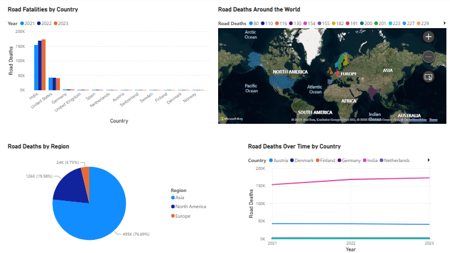
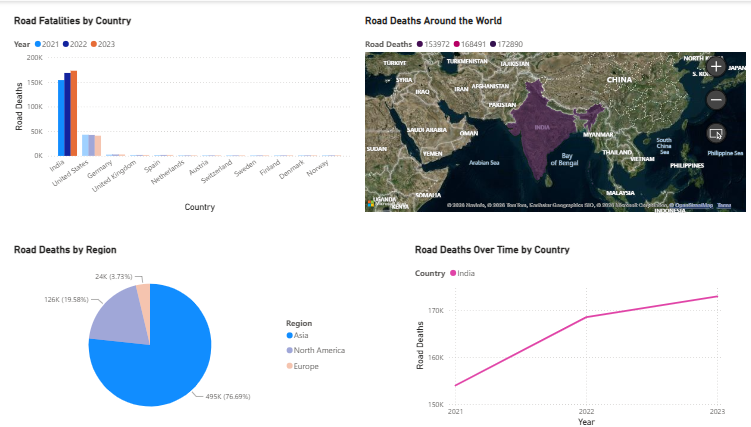
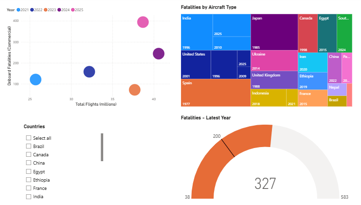
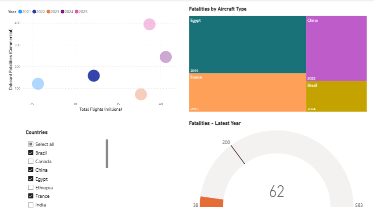

# Road Deaths & Aviation Accidents — Power BI Dashboard

An interactive Power BI report comparing global road traffic deaths and aviation fatal accidents across countries, regions, and years.

## 📊 Report Overview

The report has **two pages**:

1. **Road Deaths** — road traffic death trends by country and region.
2. **Aviation Accidents** — aviation fatality trends, flight volume, and accident counts.

## 🧩 Visuals Used

### Road Deaths page

| Visual | Type | Fields | Purpose |
|---|---|---|---|
| Road Deaths by Country | Clustered column chart | Category: Country · Series: Year · Value: Sum of Road Deaths | Compares total road deaths per country, broken down by year |
| Road Deaths Trend | Line chart | Category: Year · Series: Country · Value: Sum of Road Deaths | Shows how road deaths trend over time for each country |
| Road Deaths Map | Filled map | Category: Country · Series: Road Deaths | Shows road deaths intensity by country on a map |
| Road Deaths by Region | Pie chart | Category: Region · Value: Sum of Road Deaths | Shows the share of road deaths by region |

### Aviation Accidents page

| Visual | Type | Fields | Purpose |
|---|---|---|---|
| Country Slicer | List slicer (multi-select, header hidden) | Country of Occurrence | Filters the aviation visuals by one or more countries |
| Fatalities Gauge | Gauge | Value: Aviation Fatalities (Latest Year) · Min/Max: Min/Max Fatalities · Target: Avg Fatalities Target | Shows the latest year's fatalities against the historical range and an average target |
| Flights vs Fatalities | Scatter chart | X: Total Flights (millions) · Y: Onboard Fatalities (Commercial) · Size: Fatal Accidents (Commercial) · Series: Year | Shows the relationship between flight volume and fatalities over time |
| Fatalities Treemap | Treemap | Group: Country of Occurrence · Details: Year · Values: Sum of Fatalities | Shows which countries account for the largest share of aviation fatalities |

## 🎛️ Filter

- **Country Slicer** (Aviation Accidents page): a list-based, multi-select slicer on "Country of Occurrence" with its header hidden. Filters the gauge, scatter chart, and treemap on that page.

## 🖼️ Screenshots

**Road Deaths — overview:**

**Road Deaths — filtered by country (India):**

**Aviation Accidents — overview:**

**Aviation Accidents — filtered by country:**

## 🗂️ Data

The underlying data model contains:
- **Road Traffic Deaths** table: country, region, year, road deaths
- **Aviation Fatal Accidents** table: country of occurrence, year, fatalities
- **Aviation_Global_Summary** table: year, total flights (millions), onboard fatalities (commercial), fatal accidents (commercial)
- **KeyMeasures** table: DAX measures for min/max/latest/target fatalities used in the gauge

## 🚀 How to Use

1. Clone/download this repository.
2. Open `Accidents.pbix` in [Power BI Desktop](https://powerbi.microsoft.com/desktop/).
3. On the Aviation Accidents page, use the country slicer to filter the gauge, scatter chart, and treemap.
4. Switch between the Road Deaths and Aviation Accidents pages using the page tabs.

## 🛠️ Tech Stack

- Power BI Desktop
- DAX (measures for min/max/latest/target fatalities, aggregated sums)

## 📌 Notes

- Feel free to fork this project and adapt it to other countries or time ranges.
- Contributions and suggestions are welcome via issues or pull requests.
